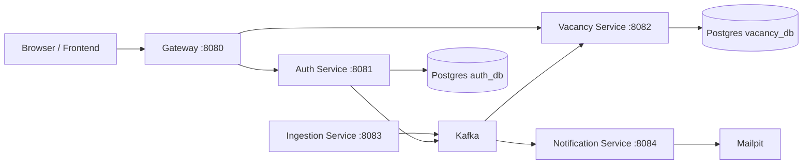

# RoleRadar

RoleRadar is a backend-first job aggregation platform built as a microservices monorepo.

The project is intentionally more architecture-heavy than the domain strictly requires. The goal is to practice and demonstrate backend engineering concerns such as:

- event-driven processing with Kafka
- service boundaries and data ownership
- JWT auth with refresh token flow
- API Gateway as the browser/security boundary
- idempotent event handling
- race condition recovery
- production-oriented local setup with Docker, health checks, CI, and integration tests

## Project Status

Current stage: backend V1 is largely implemented, frontend is the next major milestone.

Already implemented:

- API Gateway, Auth, Ingestion, Vacancy, and Notification services
- Kafka-based ingestion pipeline
- email verification flow
- JWT access tokens and refresh tokens
- HttpOnly cookie handling via Gateway
- idempotent vacancy event processing
- vacancy upsert race recovery
- Flyway migrations
- health checks
- GitHub Actions for tests, Docker build validation, image publishing, and Qodana
- integration tests across services

Planned next:

- frontend application
- better product-level docs and demo flow
- additional ingestion sources
- extraction of common/shared patterns where duplication starts to grow

## Architecture Summary

More detail:

- [Architecture Notes](./docs/architecture.md)
- [Runbook](./docs/runbook.md)
- [Next Steps](./docs/next-steps.md)

AI-oriented local context:

- [AI Context Pack](./.ai-context/README.md)

## Services

### `gateway`

Responsibilities:

- single browser entry point
- reads/writes auth cookies
- validates access tokens
- forwards bearer token downstream
- exposes aggregated Swagger entry

Default port: `8080`

### `auth-service`

Responsibilities:

- registration and login
- JWT issuing/signing
- refresh token storage and revocation
- email verification token lifecycle
- JWKS exposure
- `/me` endpoint

Default port: `8081`

### `vacancy-service`

Responsibilities:

- vacancy source of truth
- vacancy search/list/detail endpoints
- idempotent processing of `VacancyUpsertedEvent`
- processed-event tracking
- stale vacancy closing and cleanup jobs
- recovery from unique-constraint races during upsert

Default port: `8082`

### `ingestion-service`

Responsibilities:

- fetches external vacancy APIs
- normalizes provider payloads
- publishes vacancy upsert events to Kafka
- scheduled ingestion jobs

Current sources:

- Remotive
- Arbeitnow
- Adzuna

Default port: `8083`

### `notification-service`

Responsibilities:

- consumes email verification events
- sends email through SMTP
- local testing via Mailpit

Default port: `8084`

## Local Infrastructure

`compose.yml` starts the local backend stack:

- `postgres-auth`
- `postgres-vacancy`
- `kafka`
- `kafka-ui`
- `mailpit`
- all five application services

Useful local URLs:

- Gateway: `http://localhost:8080`
- Gateway Swagger UI: `http://localhost:8080/swagger-ui.html`
- Kafka UI: `http://localhost:8085`
- Mailpit UI: `http://localhost:8025`

## Tech Stack

- Java 21
- Spring Boot
- Spring Security
- Spring Cloud Gateway
- PostgreSQL
- Flyway
- Kafka
- Docker Compose
- Gradle
- JUnit 5
- Testcontainers
- GitHub Actions

## Testing and CI

This repository already has CI coverage for the backend services.

GitHub workflows:

- `.github/workflows/ci.yml` - runs service tests
- `.github/workflows/docker-build.yml` - validates Docker builds
- `.github/workflows/publish-images.yml` - publishes images from `main`
- `.github/workflows/qodana_code_quality.yml` - static analysis

Notes:

- some integration tests use Testcontainers, so local Docker availability matters
- in constrained environments, tests that depend on Docker may fail even when the code is healthy

## Frontend Status

`frontend/roleradar-web` exists as a placeholder, but the real frontend implementation has not started yet.

The next sensible milestone is a thin client talking only to the Gateway, with an MVP scope like:

- auth screens
- vacancy list
- vacancy filters/search
- vacancy details

## Why This Project Exists

This project is meant to be both:

- a real learning platform for backend architecture decisions
- a portfolio project that demonstrates practical engineering trade-offs, not just CRUD

That is why some choices are intentionally more ambitious than the minimum needed for the domain.

## AI Session Tip

When starting a new AI-assisted session, the most useful files to read first are:

- `./.ai-context/README.md`
- `./docs/architecture.md`
- `./docs/runbook.md`
- `./docs/next-steps.md`
